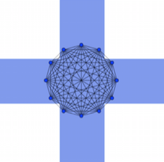

# Social Mesh

<strong style="font-size: 1.8em;">Social Mesh</strong> is a system of platform cooperativism, in which:

- Personal data vaults enable the open web to function as ***a utility layer for general platform cooperativism***  

- Personal data servers are ***physically located in the communities they serve, and integrated into local meshnets***
    + *Forming a platform cooperativism utility layer with the resilience of the original ARPANET - i.e. the platform functions whether running locally in only one town (e.g. [the Wörgl experiment](https://en.wikipedia.org/wiki/W%C3%B6rgl#The_W%C3%B6rgl_Experiment)), nationally, or internationally, and can re-seed from one source*  
   
- This utility layer is a state service, ***integrating the national internet from local private meshnets***
    + *Cooperative industries need a universal platform, instead of competing in vertical markets against private incumbents*
    + *For horizontal platform cooperativism to succeed, state backing is needed to counteract the momentum of financialisation and regulatory arbitrage*

